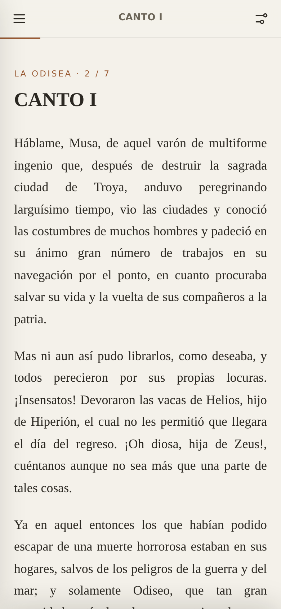

# 📖 html-book-reader

Publica libros de dominio público (como *La Odisea*) como **páginas HTML
autónomas** que se leen cómodamente en el móvil, la tablet o el ordenador.

Cada libro se convierte en **un único archivo `.html`** con el texto, los
estilos y el JavaScript incrustados. Funciona sin conexión, no necesita
servidor y puedes abrirlo con doble clic o subirlo a cualquier hosting estático
(GitHub Pages, Netlify, un pen-drive…).



## Qué incluye el lector

- 📑 **Índice** deslizable con todos los capítulos
- ◀ ▶ **Navegación** capítulo a capítulo (y con las flechas del teclado)
- 🌗 **Temas**: claro, sepia y oscuro (respeta el del sistema por defecto)
- 🔠 **Tamaño de letra** y elección **serif / sans**
- 📍 **Recuerda** en qué capítulo y punto te quedaste (por libro, en el navegador)
- 📏 Barra de **progreso** de lectura
- 📱 Diseño *mobile-first*, con soporte para el *notch* del iPhone

Sin dependencias, sin *frameworks*, sin rastreadores. Solo Node para generar los
archivos.

## Uso rápido

Necesitas [Node.js](https://nodejs.org) (v16 o superior). No hay que instalar
nada más.

```bash
node publish.js
```

Se generan los archivos en `dist/`:

- `dist/index.html` — la **biblioteca** con todos los libros
- `dist/<libro>.html` — el **lector** de cada libro

Ábrelos en el navegador. ¡Ya está!

## Publicar un libro nuevo

1. Crea una carpeta dentro de `books/`, por ejemplo `books/mi-libro/`.
2. Pon el texto plano en `books/mi-libro/source.txt`.
   Sirve tal cual, por ejemplo, un `.txt` de [Project Gutenberg](https://www.gutenberg.org)
   o [Wikisource](https://es.wikisource.org). La cabecera y el pie de licencia
   de Gutenberg se recortan automáticamente.
3. Crea `books/mi-libro/meta.json` con los datos del libro (ver abajo).
4. Ejecuta `node publish.js`.

### `meta.json`

```json
{
  "title": "La Odisea",
  "author": "Homero",
  "translator": "Luis Segalá y Estalella",
  "year": "s. VIII a. C.",
  "language": "es",
  "cover": "🏛️",
  "coverBg": "linear-gradient(160deg,#1f6f8b,#0b3d4d)",
  "description": "Breve reseña para la biblioteca.",
  "chapterPattern": "^CANTO\\b.*",
  "verse": false
}
```

| Campo            | Para qué sirve                                                                 |
|------------------|-------------------------------------------------------------------------------|
| `title`          | Título (obligatorio en la práctica).                                          |
| `author`         | Autor.                                                                         |
| `translator`     | Traductor/a, si aplica.                                                        |
| `year`, `language` | Metadatos informativos.                                                      |
| `cover`          | Emoji que se usa como portada en la biblioteca.                               |
| `coverBg`        | Color o degradado CSS de la portada.                                          |
| `description`    | Reseña corta para la tarjeta de la biblioteca.                               |
| `chapterPattern` | *Regex* que marca el inicio de cada capítulo. Si se omite, se detectan solas líneas como `CANTO…`, `CAPÍTULO…`, `LIBRO…`, `PARTE…`, `CHAPTER…`, etc. |
| `verse`          | `true` conserva los saltos de línea (poesía); `false` (por defecto) une los párrafos. |

### Cómo se separan los capítulos

El publicador recorre el texto línea a línea. Una línea **corta** que coincide
con `chapterPattern` (o con los patrones por defecto) abre un capítulo nuevo y
su texto se usa como título. El texto anterior al primer capítulo se convierte
en un capítulo inicial (útil para prólogos o notas). Los párrafos se separan por
líneas en blanco, y `* * *` se muestra como separador de escena.

## El ejemplo: *La Odisea*

`books/la-odisea/` trae una **edición de muestra** con fragmentos de dominio
público, suficiente para ver el lector en acción. Para publicar la obra
completa, sustituye `books/la-odisea/source.txt` por el texto íntegro (por
ejemplo, [Project Gutenberg #58221](https://www.gutenberg.org/ebooks/58221),
traducción de Luis Segalá y Estalella) y vuelve a ejecutar `node publish.js`.

## Publicar en la web

Como cada lector es un archivo estático, cualquier hosting sirve. Los enlaces
entre la biblioteca y los libros son relativos, así que también funciona en un
subdirectorio.

### Cloudflare Pages

El repositorio ya trae la configuración lista (`wrangler.jsonc` y un *workflow*
de GitHub Actions). Elige **una** de estas tres formas:

**Opción A — Conectar el repo (recomendada, sin secretos).**
En el panel de Cloudflare: *Workers & Pages → Create → Pages → Connect to Git*,
elige este repositorio y usa:

- *Build command*: `node publish.js`
- *Build output directory*: `dist`

Cada `git push` publicará el sitio automáticamente en
`https://biblioteca-abierta.pages.dev`.

**Opción B — GitHub Actions (alternativa manual).**
Añade dos *secrets* al repo (*Settings → Secrets and variables → Actions*):

- `CLOUDFLARE_API_TOKEN` — un token con el permiso *Cloudflare Pages: Edit*
- `CLOUDFLARE_ACCOUNT_ID` — tu *Account ID* (panel de Cloudflare → *Workers & Pages*)

Ejecuta el *workflow* `.github/workflows/deploy-cloudflare.yml` desde
*Actions → Deploy to Cloudflare Pages → Run workflow*. Está configurado como
manual para no fallar si faltan los *secrets*; añade un disparador `push:` si
quieres que despliegue en cada *push*. (Si ya usas la Opción A, no necesitas
esta.)

**Opción C — Desde tu ordenador.**

```bash
npx wrangler login          # abre el navegador para autenticarte
npm run deploy              # genera dist/ y lo sube a Cloudflare Pages
```

> El nombre del proyecto (`biblioteca-abierta`) y, por tanto, el subdominio
> `*.pages.dev`, se cambian en `wrangler.jsonc`. Puedes añadir un dominio propio
> desde el panel de Cloudflare, en el proyecto → *Custom domains*.

### GitHub Pages

Sirve la carpeta `dist/` (por ejemplo con la acción oficial de Pages, o
publicando esa carpeta en la rama `gh-pages`).

## Estructura del proyecto

```
html-book-reader/
├── publish.js                 ← generador (Node, sin dependencias)
├── wrangler.jsonc             ← configuración de Cloudflare Pages
├── .github/workflows/         ← despliegue automático a Cloudflare
├── library.json               ← título y lema de la biblioteca
├── src/
│   ├── reader.template.html    ← plantilla del lector
│   └── library.template.html   ← plantilla de la biblioteca
├── books/
│   └── la-odisea/
│       ├── meta.json
│       └── source.txt
└── dist/                       ← salida generada (HTML listo para usar)
```

## Licencia

Código bajo licencia MIT. Los textos que publiques deben estar en **dominio
público** o contar con permiso; este proyecto no incluye ninguna obra con
derechos vigentes.
